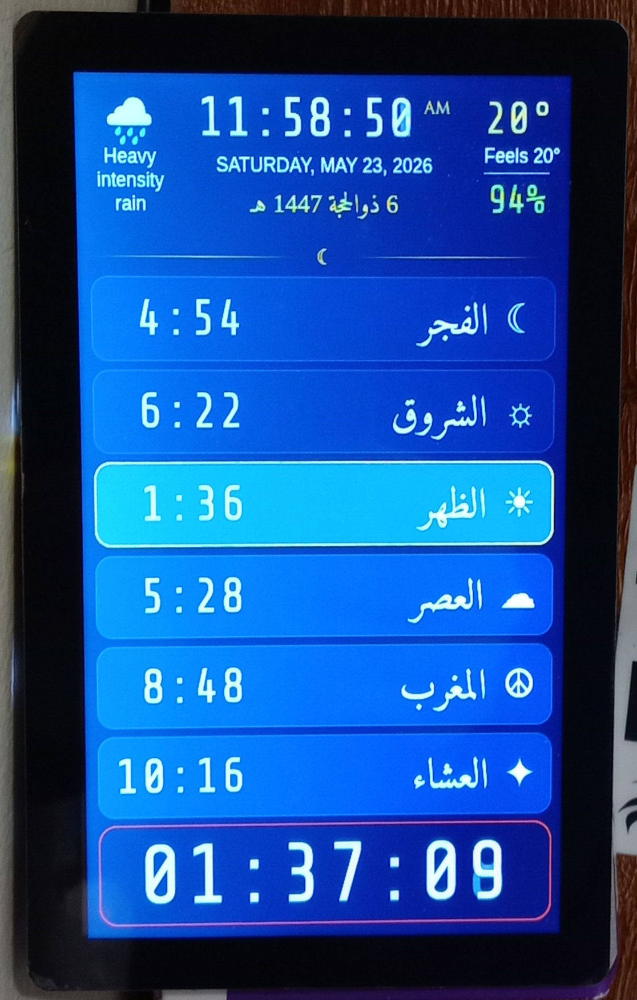
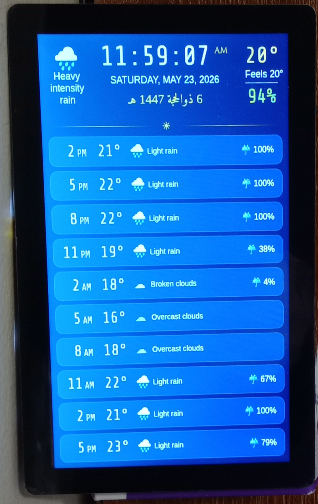

# Azan Dashboard

A lightweight, kiosk-based display system for showing Islamic prayer times, weather forecasts, and weather alerts.

|                Prayer Times              |              Weather           |                Weather Alert               |
|:----------------------------------------:|:------------------------------:|:------------------------------------------:|
|  |  |  |

## Project Overview

This project is specifically designed for **Proxmox LXC containers** (Debian 13) with proper hardware acceleration and audio forwarding. It uses a modern Wayland stack to give you a solid, embedded display system that just works.

At its core, it combines three layers: a Python backend serving static files, a responsive web frontend, and a Wayland-based kiosk display.

### Key Features
- **Prayer Times**: Accurate calculations using the [adhan-js](https://github.com/batoulapps/adhan-js) library with support for various calculation methods (ISNA, MWL, etc.) and Madhabs.
- **Visual Alerts**: Highlights the current prayer and provides a countdown to the next one.
- **Audio Notifications**: Plays Adhan audio files at prayer times.
- **Weather Integration**: Displays current conditions and hourly forecasts using OpenWeatherMap, plus National Weather Service (US) weather alerts.
- **Kiosk Mode**: Auto-starts in full-screen mode, with optional remote VNC access for troubleshooting.
- **Containerized Architecture**: Designed to run efficiently in an LXC container while leveraging the host's hardware resources.


## System Architecture & How It Works

Here's the tricky part: you can't just run a graphical app in a container and have it access your host's GPU and audio. You need a specific architecture to bridge the gap between the container and the host's hardware.

### 1. Display Stack (Wayland & Seatd)
*   **Seatd (Host)**: A seat management daemon that acts as a gatekeeper on your Proxmox host. It manages who gets access to hardware like the GPU (`/dev/dri`) and input devices.
*   **Cage (Container)**: A lightweight Wayland compositor running inside your LXC. It connects to the host's `seatd` socket to ask for permission to render directly to the screen.
*   **Chromium (Container)**: Runs in kiosk mode on top of Cage, displaying your dashboard.

### 2. Audio Stack (PipeWire)
*   **PipeWire (Host)**: Runs as a system service on your Proxmox host, managing the actual audio hardware.
*   **Socket Forwarding**: You'll mount the host's PipeWire socket into the container (bind-mount).
*   **Client (Container)**: Chromium inside the container connects to this mounted socket, which essentially "tunnels" audio out to your host's speakers.

### 3. Backend
*   **Python Server**: A lightweight wrapper around Python's built-in `http.server`. It serves the static files and gives the frontend an API to discover audio files on the fly.

### 4. Remote Management
*   **WayVNC**: A VNC server that connects to the Cage session, so you can view the kiosk screen remotely on port `5900`. This feature is only for debugging since my development machine and the azan dashboard are in different rooms and it helped save time and walks to the other room during development and testing.

---

## Installation Instructions

I'm assuming you've got **Proxmox VE** running on your host and you'll be setting this up in a **Debian 13** LXC container.

### Part 1: Proxmox Host Configuration

Before setting up the container, the host must be configured to share hardware access.

#### 1. Install and Configure `seatd`
1.  Install seatd:
    ```bash
    apt update && apt install -y seatd
    ```
2.  Configure it to use the `video` group:
    ```bash
    systemctl edit seatd.service
    ```
    Add or modify these lines:
    ```ini
    [Service]
    ExecStart=
    ExecStart=seatd -g video
    ```
3.  Restart seatd:
    ```bash
    systemctl daemon-reload
    systemctl restart seatd
    ```

#### 2. Install and Configure PipeWire (System-wide)
1.  Install the PipeWire packages:
    ```bash
    apt install pipewire pipewire-pulse wireplumber
    ```
2.  Create a dedicated PipeWire user:
    ```bash
    useradd -r -s /usr/sbin/nologin -G audio,video pipewire
    ```
3.  Create the systemd service file:
    ```bash
    nano /etc/systemd/system/pipewire.service
    ```
    Add this content:
    ```ini
    [Unit]
    Description=PipeWire System Service
    After=network.target

    [Service]
    Type=simple
    User=pipewire
    Group=pipewire
    RuntimeDirectory=pipewire
    Environment=XDG_RUNTIME_DIR=/run/pipewire
    ExecStart=/usr/bin/pipewire
    ExecStartPost=/bin/bash -c "until [ -S /run/pipewire/pipewire-0 ]; do sleep 0.1; done; chmod 666 /run/pipewire/pipewire-0"
    Restart=always

    [Install]
    WantedBy=multi-user.target
    ```
4.  Enable and start:
    ```bash
    systemctl daemon-reload
    systemctl enable --now pipewire
    ```

#### 3. Configure LXC Permissions (ID Mapping)
1.  Edit `/etc/subgid` to allow your container to map the video (44) and audio (29) groups:
    ```bash
    nano /etc/subgid
    ```
    Add:
    ```
    root:29:1
    root:44:1
    ```
2.  Edit your LXC config file (e.g., `/etc/pve/lxc/100.conf`):
    ```bash
    nano /etc/pve/lxc/100.conf
    ```
    Add the following to map groups and mount the sockets:
    ```ini
    # ID Mappings for Audio/Video access
    lxc.idmap: u 0 100000 65536
    lxc.idmap: g 0 100000 29
    lxc.idmap: g 29 29 1
    lxc.idmap: g 30 100030 14
    lxc.idmap: g 44 44 1
    lxc.idmap: g 45 100045 65491

    # Mount Seatd Socket
    lxc.mount.entry: /run/seatd.sock opt/seatd.sock none bind,create=file 0 0

    # Mount PipeWire Socket
    lxc.mount.entry: /run/pipewire/pipewire-0 opt/pipewire-0 none bind,create=file 0 0
    ```
3.  **Restart the LXC container** — without this, the socket mounts won't work.

---

### Part 2: LXC Container Installation (Debian 13)

Now, log into your Debian LXC container and follow these steps:

1.  **Clone or Copy the Project**:
    Move the `azan` directory into `/opt/azan`.

2.  **Run the Installer**:
    The `install.sh` script takes care of installing dependencies, creating the right user, and setting up services.
    ```bash
    cd /opt/azan
    chmod +x install.sh
    ./install.sh
    ```

3.  **Start Services**:
    The installer creates three systemd services:
    *   `azan-dashboard.service`: Python web server
    *   `azan-kiosk.service`: Your graphical display (Cage + Chromium)
    *   `azan-vnc.service`: Remote VNC access

    The installer does not start them automatically, you can fire them up manually:
    ```bash
    systemctl start azan-dashboard
    systemctl start azan-kiosk
    systemctl start azan-vnc
    ```

    The vnc service is not enabled by default as it has a memory leak or something that makes it take up all the assigned RAM until the LXC becomes unresponsive. Use it for debugging when needed, but disable or uninstall it once done.
---

## Configuration

All the settings are in `static/config.js`.

### Location, Calculation Method, and Weather API

You'll need to set your GPS coordinates so the dashboard can calculate prayer times for your exact location. You can also choose your calculation method (ISNA, Muslim World League, Egyptian, etc.) and how Asr time is calculated. For weather, you'll need an OpenWeatherMap API key — register for a free account, generate an API key, and paste it in the config.js.

Here's how to edit your settings:
1.  Open the config file:
    ```bash
    nano /opt/azan/static/config.js
    ```
2.  Update these sections:

    *   **Geographic Location**:
        ```javascript
        latitude: 36.9981184,
        longitude: -87.1440034,
        elevation: 6.46,
        weatherApiKey: 'your_openweathermap_api_key_here'
        ```
    *   **Calculation Method**:
        Set `calculationMethod` to **NorthAmerica**, **MuslimWorldLeague**, **Egyptian**, etc.
    *   **Audio**:
        Turn specific prayers on or off, or point to different audio folders.
    *   **Weather**:
        Paste your OpenWeatherMap API key into `weatherApiKey`.

3.  **Apply Changes**:
    Restart the kiosk service to pick up your changes:
    ```bash
    systemctl restart azan-kiosk
    ```

### Azan Audio Files
No audio files are included in this repo, and you'll need to provide your own. I've tested with `.mp3` files, but since the dashboard runs in Chromium, most audio formats should work. Download azan recordings from public sources or record your own. Put Fajr azan in the `static/audio/fajr` folder and everything else in `static/audio/others`. You can add multiple files to each folder; the dashboard will pick one at random for each prayer.

If your audio files are noisy, use the `denoise-audio.sh` script to clean them up and make other adjustments. Check the configuration section at the top of that script to see what you can tweak.

## Scheduled Screen Power ON/OFF

Use `cron` to turn your screen off at night and back on in the morning. This can help with saving power at night and extending screen life.

1.  Open your crontab:
    ```bash
    crontab -e
    ```

2.  Add these lines to turn the screen off at 11:00 PM and on at 4:00 AM:
    ```cron
    # Turn the screen off at night
    0 23 * * * /opt/azan/screen.sh off
    # Turn the screen back on in the morning
    0 4  * * * /opt/azan/screen.sh on
    ```

---

## Troubleshooting & Support

If you run into issues, check that:
- The LXC container's been restarted after config changes
- `seatd` is running on the host (`systemctl status seatd`)
- PipeWire is running (`systemctl status pipewire`)
- Your audio and video groups are mapped correctly in the LXC config

Feel free to open an issue if you get stuck!

---

*Developed with partial assistance from AI tools*
